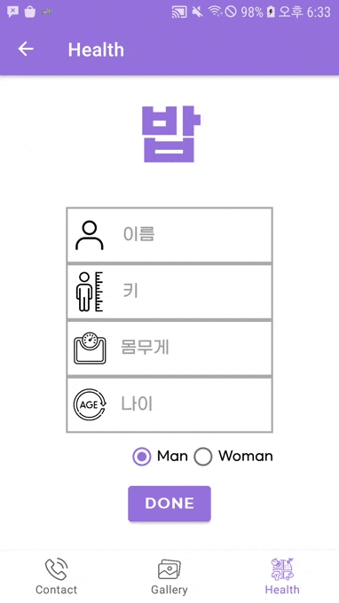

# 선우야 잠 좀 자자


## Introduction
### Abstraction
**선우야 잠 좀 자자** is an Android-application that has 3 tabs: Contact, Gallery, 밥. Overall, **선우야 잠 좀 자자** is implemented with navigation and fragments.

### Development Envrionment
- **IDE**: Android Studio
- **Development Language**: Kotlin
- **Testing Device**
    - Device Model: SM-G930K (Samsung Galaxy S7)
    - Android Version: 8.0.0

---
## Tab Explanation in detail
### **Tab 1. Contacts**   
Tab that retrieves phone's contact list, and the user can search, add contact, call, message here.
* You need autorhization permission: `READ_CONTACTS`, and `CALL_PHONE`
* Retrieving contact list
    - Core function: `getPhoneNumbers(sort: String, searchName: String?): List<ContactItem>`
        - Uses [ContactsContract](https://developer.android.com/reference/android/provider/ContactsContract), [ContentResolver](https://developer.android.com/reference/android/content/ContentResolver), [Cursor](https://www.google.com/search?q=kotlin+cursor&oq=kotlin+cursor&aqs=chrome..69i57.1736j0j4&sourceid=chrome&ie=UTF-8) to retrieve data
        ```kotlin
        private fun getPhoneNumbers(sort:String, searchName:String?) : List<ContactItem> {
        val list = mutableListOf<ContactItem>()

        // 1. Phone Number Uri
        val phoneUri = ContactsContract.CommonDataKinds.Phone.CONTENT_URI

        // 2.1 columns to get from phoneUri
        val projections = arrayOf(
            ContactsContract.CommonDataKinds.Phone.CONTACT_ID,
            ContactsContract.CommonDataKinds.Phone.DISPLAY_NAME,
            ContactsContract.CommonDataKinds.Phone.NUMBER
        )
        // 2.2 conditions
        var where:String? = null
        var values:Array<String>? = null
        // search available only when there is value in searchName
        if(searchName?.isNotEmpty() ?: false) {
            where = ContactsContract.CommonDataKinds.Phone.DISPLAY_NAME + " like ?"
            values = arrayOf("%$searchName%")
        }

        // 2.3 using sort query
        val optionSort = ContactsContract.CommonDataKinds.Phone.DISPLAY_NAME + " $sort"

        // 3. query contact data from table
        val cursor = requireActivity().contentResolver.query(phoneUri, projections, where, values, optionSort)

        while(cursor?.moveToNext()?:false) {
            val id = cursor?.getString(0)   // CONTACT_ID
            val name = cursor?.getString(1) // DISPLAY_NAME
            var number = cursor?.getString(2)   // NUMBER

            val phone = ContactItem(id, name, number)
            list.add(phone)
        }

        return list
        ```
    - As return type implies, user data will be wrpaped as `ContactItem` data class.
    - Data taken will be visualized with RecyclerView. For further information, please refer `contact/ContactAdapter.kt`, `contact/ContactFragment.kt`, `res/layout/item_contact.kt`
* Misc
    - The user can call by pressing button
    - The user can message by pressing button
    - The user can add contact by pressing button
    - When the user press the item for a long time, alertDialog will be shown so that user can enjoy activities.
* Demo  
<p float="left">


</p>  

  
### **Tab 2. Custom Gallery**
Tab that user can search pixabay images and informations.
* Searching images and informations
  - Used [Pixabay Developer API](https://pixabay.com/ko/service/about/api/) that [Pixabay](https://pixabay.com/) provides. You can get `image URL`, `relative tags`, `image information` (including views, downloads, likes, etc...). This information will be wrapped as `AddImageData` data class.
  - This image lists will be visualized by RecyclerView with `AddImageAdapter` class.
  - For code that I use for API communication, please refer `Gallery/ApiImageInfo.kt`
  - For code used for RecyclerView, please refer `Gallery/AddImageAdapter.kt`, `res/layout/item_add_image`.
  - When you click button, fragment `WebViewFragment` will be called with url argument(passed as bundle).
* Misc
  - The user can search images by pressing button
  - The user can navigate to original image website by pressing image
* Demo

<p float="left">


</p>

### **Tab 3. 밥**    
Tab that you can check how much you ate. 밥 is consisted with 2 fragments: *Login fragment* and *Main Fragment*. User can enter foods that they ate, and 밥 will visualize how much the user ate compared to user's BMR as pie chart.
#### Login Fragment
* Get user's physical data that is required for calculating BMR(Basal Metabolic Rate, 기초대사량)
* This information contains: User name, height(cm), weight(kg), age, and sex.
* This information will be wrapped as `Profile` data class, and will be stored as SharedPreferences. This will let users not to input profile information on and on which is quite cumbersome.
    - Originally, this information was passed via bundle, but for I modified it as SharedPreferences to reduce hassle login action.
* For detail, refer `healthcare/LoginFragment.kt`, `res/layout/fragment_healthcare_login.xml`

#### Main Fragment
1. Profile Information
- Used [MPAndroidChart](https://github.com/PhilJay/MPAndroidChart) to visualize how much user ate compared to user BMR as Pie Chart.
- Demo  
<p>


</p>

2. Searching 
- Used [식품영양성분DB(NEW)](https://www.foodsafetykorea.go.kr/api/newDatasetDetail.do) that 식품의약품안전처 식품안전정보원 provides. You can get `Food maker name`, `nutrition informaiton`(including serving weight, total calories, carbohydrate, protein, fat, etc...). This information will be wrapped as `FoodData` data class
- This food lists will be visualized by RecyclerView with `HealthAdapter` class.
- If the user provide the weight of food he/she ate, it will adjust calories. If not, it will use Serving per container as default value.
- For code that I use for API communication, please refer `healthcare/ApiFoodInfo.kt`
- For code used for RecylerView, please refer `healthcare/HealthAdapter.kt`, `res/layout/item_food_data.xml`, 
- Demo  
|||

3. Misc
- User can edit personal physcail profile by pressing button
- User can see how much and what he/she ate during the day by pressing button
    - It will pop up alertDialog with lists
    - When the user press list element, the food user ate will be deleted

- To store data(user profile, food history), I used [gson](https://github.com/google/gson) for data class - string conversion.
- For implementation details, please refer `healthcare/MainFragment.kt`, `healthcare/ApiFoodInfo.kt`, `healthcare/HealthAdapter.kt`


### Appendix
- API calling fragment (using `APIFoodInfo` as example)
```kotlin
class ApiFoodInfo(private val keyName: String): Thread() {
    lateinit var foodList: MutableList<FoodData>

    override fun run() {
        super.run()
        foodList = getData()
    }

    // take tada
    private fun getData(): MutableList<FoodData> {
        // return value
        val foodArr = mutableListOf<FoodData>()

        // site url
        val base_url = "http://openapi.foodsafetykorea.go.kr/api/6abc28c56a754c01843f/I2790/json/1/100/DESC_KOR="
        val site = base_url + "\"${keyName}\""

        val url = URL(site)
        val conn = url.openConnection()
        val input = conn.getInputStream()
        val isr = InputStreamReader(input)
        // br: to read data as line unit
        val br = BufferedReader(isr)

        var str: String? = null
        val buf = StringBuffer()

        do{
            str = br.readLine()
            if(str!=null)
                buf.append(str)
        }while (str!=null)

        val root = JSONObject(buf.toString()).getJSONObject("I2790")

        if(JSON_Parse(root, "total_count") == "0")
            return mutableListOf<FoodData>()

        val items = root.getJSONArray("row")

        for (i in 0 until items.length()) {
            val jObject = items.getJSONObject(i)

            val foodName = JSON_Parse(jObject, "DESC_KOR")
            if (foodName == "no data") {
                continue
            }

            val servingWt = getDouble(JSON_Parse(jObject, "SERVING_SIZE"))
            val nutrCont1 = getDouble(JSON_Parse(jObject, "NUTR_CONT1"))
            val nutrCont2 = getDouble(JSON_Parse(jObject, "NUTR_CONT2"))
            val nutrCont3 = getDouble(JSON_Parse(jObject, "NUTR_CONT3"))
            val nutrCont4 = getDouble(JSON_Parse(jObject, "NUTR_CONT4"))
            val nutrCont5 = getDouble(JSON_Parse(jObject, "NUTR_CONT5"))
            val nutrCont6 = getDouble(JSON_Parse(jObject, "NUTR_CONT6"))
            val nutrCont7 = getDouble(JSON_Parse(jObject, "NUTR_CONT7"))
            val nutrCont8 = getDouble(JSON_Parse(jObject, "NUTR_CONT8"))
            val nutrCont9 = getDouble(JSON_Parse(jObject, "NUTR_CONT9"))
            val makerName = JSON_Parse(jObject, "MAKER_NAME")

            val nutrList = listOf(nutrCont1, nutrCont2, nutrCont3, nutrCont4, nutrCont5, nutrCont6, nutrCont7, nutrCont8, nutrCont9)

            // NULL CHECK
            if(nutrList.size == nutrList.filterNotNull().size) {
                val foodData = FoodData(foodName, servingWt!!, nutrCont1!!, nutrCont2!!, nutrCont3!!, nutrCont4!!, nutrCont5!!, nutrCont6!!, nutrCont7!!, nutrCont8!!, nutrCont9!!, makerName, 0.toFloat())
                foodArr.add(foodData)
            }
        }

        return foodArr
    }

    fun getDouble(num: String): Double? {
        return try{
            num.toDouble()
        } catch (e: NumberFormatException) {
            // Empty string
            null
        }
    }

    private fun JSON_Parse(obj: JSONObject, data: String): String {
        return try {
            obj.getString(data)
        } catch (e: Exception) {
            "no data"
        }
    }
}
```

---
## Future Works
### **1. Contacts**
- Get profile picture and visualize it with glide
- Implement profile deletion function
- Make additional fragment to visualize profile detail
- 초성검색 구현 [(Useful Resource)](https://github.com/javafa/thisiskotlin/tree/master/1st_edition/SearchJaum)
### **2. Custom Gallery**
### **3. 밥**
- Find exercise calories api, and subtarct from the total calories
- Provide detailed nutrition information
- Add animation


---
## Contacts
Contributors
- Woojin, Lee, wjl0209@kaist.ac.kr
- Sunwoo Kim, sunkim09@g.skku.edu
